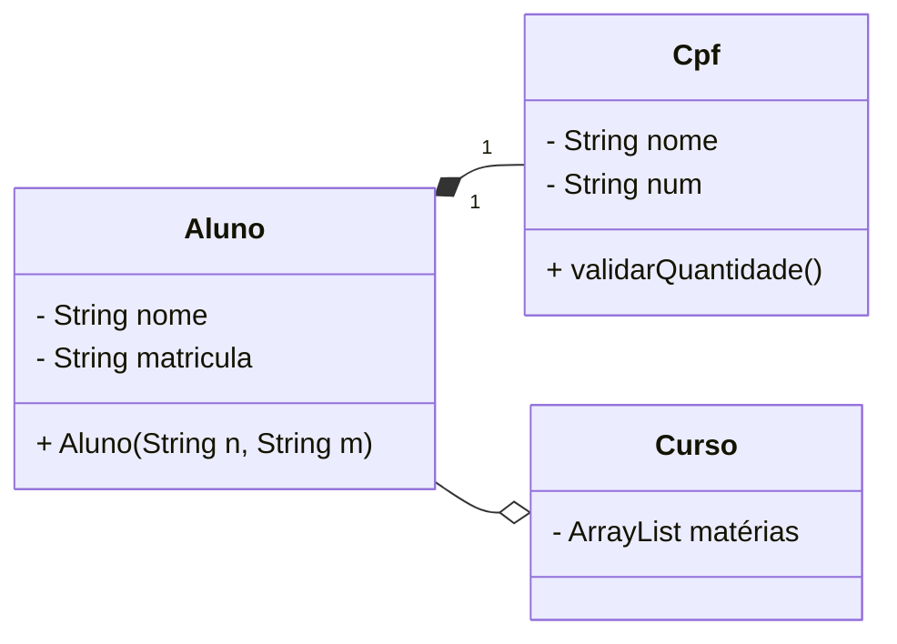

# Diagrama de classes UML

```mermaid
classDiagram

    direction LR

    class Aluno {
        - String nome
        - String matricula
        + Aluno(String n, String m)
    }

    class Curso {
        - ArrayList<Aluno> matérias
    }

    class Cpf {
        - String nome
        - String num
        + validarQuantidade()
    }

    Aluno "1" *-- "1" Cpf
    Aluno --o Curso
```