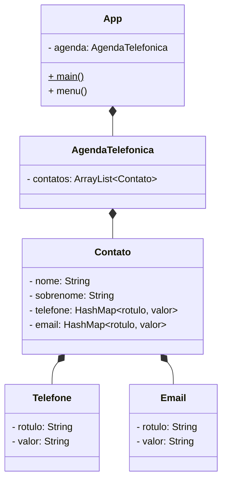

# Sistema de gestão de Agenda Telefônica

```mermaid
classDiagram
    
    class App{
        - agenda: AgendaTelefonica
        + main()$
        + menu()
    }
    
    class AgendaTelefonica{
        - contatos: ArrayList~Contato~
    }
    
    class Contato{
        - nome: String
        - sobrenome: String
        - telefone: HashMap~rotulo, valor~
        - email: HashMap~rotulo, valor~
    }
    
    class Telefone{
        - rotulo: String
        - valor: String 
    }
    
    class Email{
        - rotulo: String
        - valor: String
    }
    
    AgendaTelefonica *-- Contato
    Contato *-- Telefone
    Contato *-- Email
    App *-- AgendaTelefonica
```
