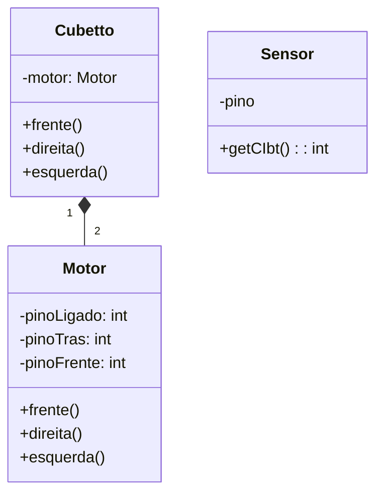

```mermaid
classDiagram
    
    class Cubetto{ 
        -motor: Motor
        +frente()
        +direita()
        +esquerda()
    }
    
    class Sensor{
        -pino
        +getCIbt(): int
    }

    class Motor{
        -pinoLigado: int
        -pinoTras: int
        -pinoFrente: int
        +frente()
        +direita()
        +esquerda()
    }
    
    Cubetto "1" *-- "2" Motor
    
```