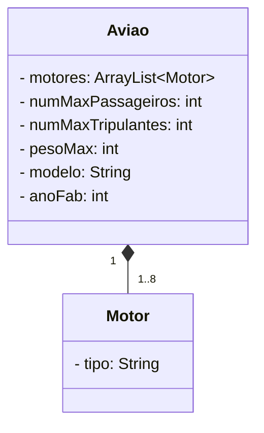

# Jogo de Aviões

```mermaid
classDiagram
    
    class Aviao{
        - motores: ArrayList~Motor~
        - numMaxPassageiros: int
        - numMaxTripulantes: int
        - pesoMax: int
        - modelo: String
        - anoFab: int
    }
    
    class Motor{
        - tipo: String
    }
    
    Aviao "1" *-- "1..8" Motor
```