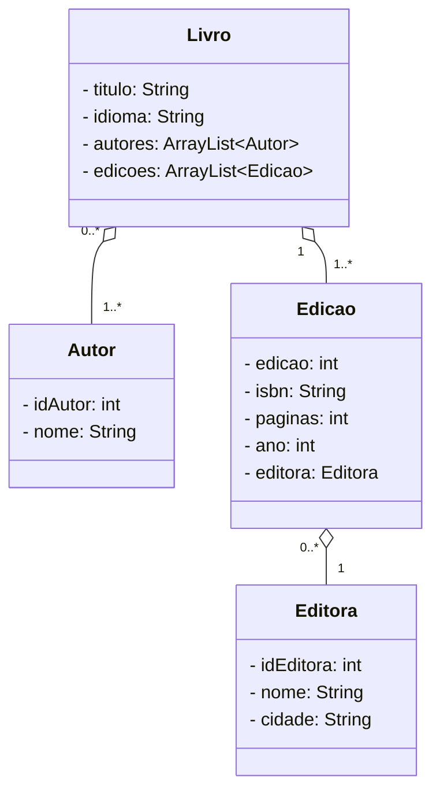

# Livraria

```mermaid
classDiagram
    
    class Livro{
        - titulo: String
        - idioma: String
        - autores: ArrayList~Autor~
        - edicoes: ArrayList~Edicao~
    }
    
    class Autor{
         - idAutor: int
         - nome: String
    }
    
    class Edicao{
        - edicao: int
        - isbn: String
        - paginas: int
        - ano: int
        - editora: Editora
    }
    
    class Editora{
        - idEditora: int
        - nome: String
        - cidade: String
    }
    
    Livro "1" o-- "1..*" Edicao
    Livro "0..*" o-- "1..*" Autor
    Edicao "0..*" o-- "1" Editora
```