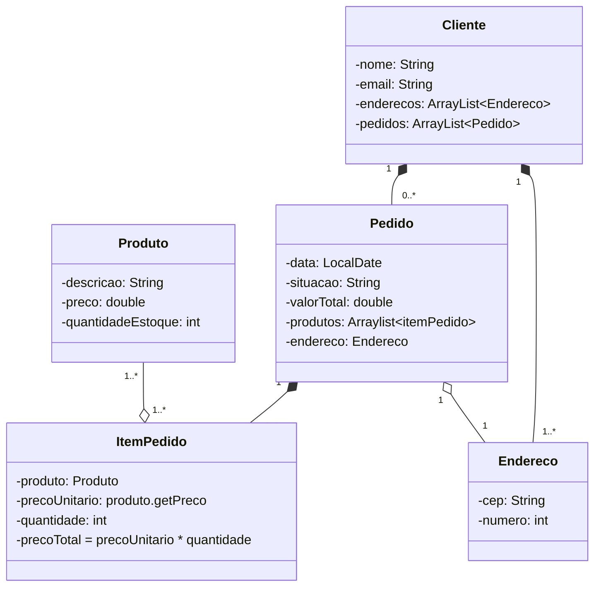

# Sistema de Comércio eletrônico

```mermaid
classDiagram
    
    class Produto{
        -descricao: String
        -preco: double
        -quantidadeEstoque: int
    }
    
    class Cliente{
        -nome: String
        -email: String
        -enderecos: ArrayList~Endereco~
        -pedidos: ArrayList~Pedido~
    }
    
    class Endereco{
        -cep: String
        -numero: int
    }
    
    class Pedido{
        -data: LocalDate
        -situacao: String
        -valorTotal: double
        -produtos: Arraylist~itemPedido~
        -endereco: Endereco
    }
    
    class ItemPedido{
        -produto: Produto
        -precoUnitario: produto.getPreco
        -quantidade: int
        -precoTotal = precoUnitario * quantidade
        
    }
    
    Cliente "1" *-- "0..*" Pedido
    Cliente "1" *-- "1..*" Endereco
    Pedido "1" *-- "1..*" ItemPedido
    Pedido "1" o-- "1" Endereco
    Produto "1..*" --o "1..*" ItemPedido
```