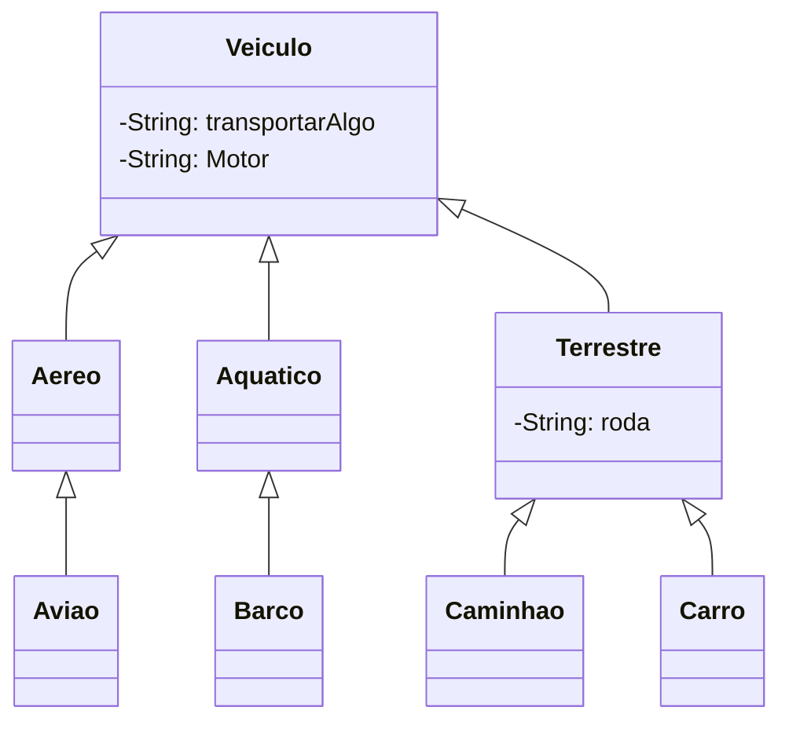

```mermaid
classDiagram
    
    class Veiculo{
        -String: transportarAlgo
        -String: Motor
    }
    
    class Aereo{
        
    }
    
    class Aquatico{
        
    }
    
    class Terrestre{
        -String: roda
    }
    
    class Aviao{
        
    }
    
    class Carro{
        
    }
    
    class Caminhao{
        
    }
    
    class Barco{
        
    }
    
    Veiculo <|-- Aereo
    Veiculo <|-- Aquatico
    Veiculo <|-- Terrestre
    Aereo <|-- Aviao
    Aquatico <|-- Barco
    Terrestre <|-- Caminhao
    Terrestre <|-- Carro
```