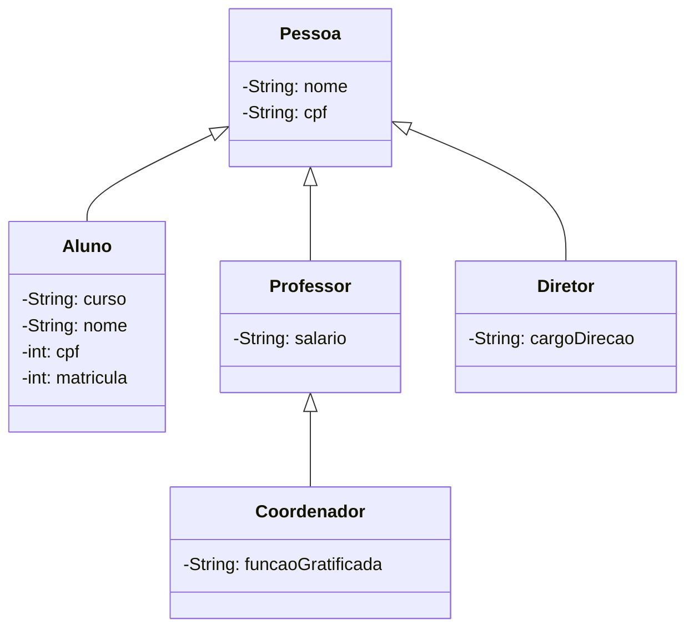

```mermaid
classDiagram
    
    class Pessoa{
        -String: nome
        -String: cpf
    }
    
    class Aluno{
        -String: curso
        -String: nome
        -int: cpf
        -int: matricula
    }
    
    class Professor{
        -String: salario
    }
    
    class Coordenador{
        -String: funcaoGratificada
    }
    
    class Diretor{
        -String: cargoDirecao
    }
    
    Pessoa <|-- Aluno
    Pessoa <|-- Diretor
    Pessoa <|-- Professor
    Professor <|-- Coordenador
```