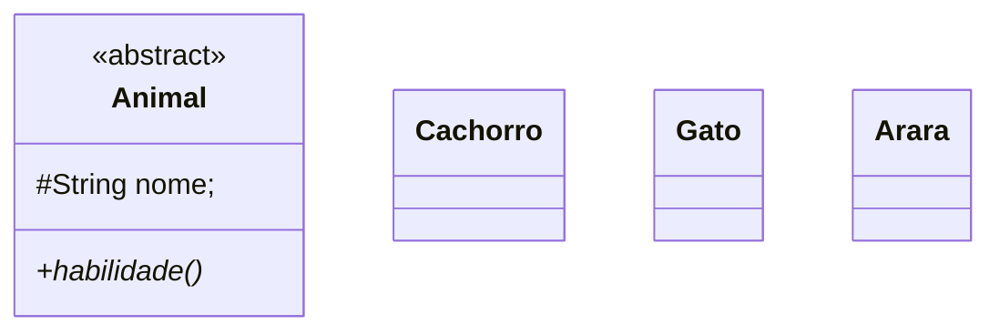

```mermaid
classDiagram
    
    class Animal{
        <<abstract>>
        #String nome;
        +habilidade()*
    }
    
    class Cachorro{
        
    }
    
    class Gato{
        
    }
    
    class Arara{
        
    }


```