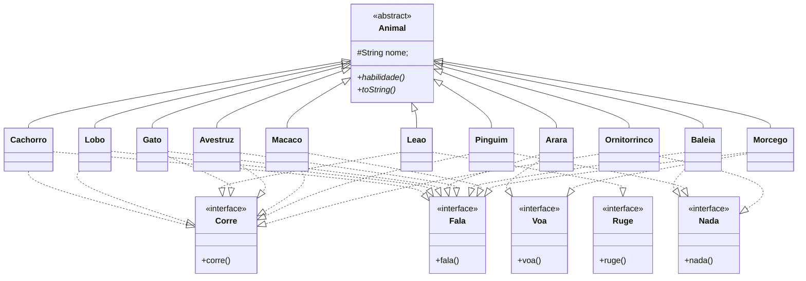

```mermaid
classDiagram
    
    class Animal{
        <<abstract>>
        #String nome;
        +habilidade()*
        +toString()*
    }

    class Corre {
        <<interface>>
        +corre() 
    }

    class Nada {
        <<interface>>
        +nada() 
    }

    class Voa {
        <<interface>>
        +voa() 
    }

    class Fala {
        <<interface>>
        +fala() 
    }

    class Ruge {
        <<interface>>
        +ruge() 
    }

    Animal <|-- Cachorro
    Animal <|-- Gato
    Animal <|-- Arara
    Animal <|-- Avestruz
    Animal <|-- Leao
    Animal <|-- Baleia
    Animal <|-- Lobo
    Animal <|-- Macaco
    Animal <|-- Morcego
    Animal <|-- Pinguim
    Animal <|-- Ornitorrinco

    Cachorro ..|> Corre
    Cachorro ..|> Fala

    Lobo ..|> Corre
    Lobo ..|> Fala

    Leao ..|> Corre
    Leao ..|> Ruge

    Gato ..|> Corre
    Gato ..|> Fala

    Arara ..|> Voa
    Arara ..|> Fala

    Avestruz ..|> Corre
    Avestruz ..|> Fala

    Baleia ..|> Nada
    Baleia ..|> Fala

    Macaco ..|> Corre
    Macaco ..|> Fala

    Morcego ..|> Voa
    Morcego ..|> Fala

    Pinguim ..|> Nada
    Pinguim ..|> Corre

    Ornitorrinco ..|> Nada
    Ornitorrinco ..|> Corre

```