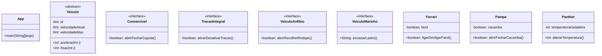

```mermaid
classDiagram
    
    class App{
        +main(String[]args)
    }
    
    class Veiculo{
        <<abstract>>
        #int: id
        #int: velocidadeAtual
        #int: velocidadeMax
        +int: acelerar(int i) *
        +int: frear(int i) *
    }
    
    class Conversivel{
        <<interface>>
        +boolean: abrirFecharCapota()
    }
    
    class TracaoIntegral{
        <<interface>>
        +boolean: ativarDesativarTracao()
    }
    
    class VeiculoAnfibio{
        <<interface>>
        +boolean: abrirRecolherRodqas()
    }
    
    class VeiculoMarinho{
        <<interface>>
        +String: esvaziarLastro()
    }
    
    class Ferrari{
        -boolean: farol
        +boolean: ligarDesligarFarol()
    }
    
    class Pampa{
        -boolean: cacamba
        +boolean: abrirFecharCacamba()
    }
    
    class Panther{
        -int: temperaturaGeladeira
        +int: alterarTemperatura()
    }
    
```
